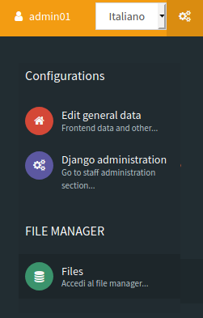

#  Management and organization of geographic data and QGIS projects
## Data on GeoDatabase PostGis

If your geographical data are stored on GeoDatabase PostGis, it will be sufficient to allow access to the GeoDB from the IP address on which the application is installed.

## Data on SpatiaLite or on other file system format

If your geographical data are stored on SpatiaLite or on physical files (.shp, .kml, .tif ...) located on your local PC, you will need:
* organize data and projects in predefined directories and subdirectories
* upload/synchronize geographic data to the default folder located on the server where the application is installed (see dedicated paragraph)

**Of course, mixed solutions with geographical data on PostGis, SpatiaLite and other formats will also be possible.**

### Organization of data and projects

Data on physical files and/or on GeoDB SpatiaLite and QGIS cartographic projects must be organized in folders with the following rules:
 * a **main directory** named and positioned in according to need's user
   * a **geographic_data** subdirectory yhat must contain the geographic data used for the various cartographic projects, such data can also be organized in subdirectories with no nesting limits.
     This directory must also contain images used in the various print layouts associated with the individual cartographic projects
   * a **projects** sub-directory that must contain the QGIS cartographic projects (.qgz or .qgs files)

### Geographic data synchronization on the server

The data stored in the local **geographic_data** directory must be synchronized on the server where the G3W-SUITE application is installed.

The geographic data stored in the local geographic_data folder must be loaded, reflecting any subdirectory structure.

To synchronize your data access to the Administration panel of G3W-ADMIN and click on the the **Configurations icon**  located in the upper right corner
Choose the **File Manager** item in the linked menù.

Using this tool it is possible to manage the physical geographic data on the server in a simple and intuitive way.

This the directories present by default:
 * **geographic_data**: the folder to store your geographic data
 * **media_user**: a folder exposed on the web, to store your multimedia files
 * **svg:** a folder to store extra SVG icons used your QGIS projects

All the folder can be organized in subdirectories with no nesting limits.

