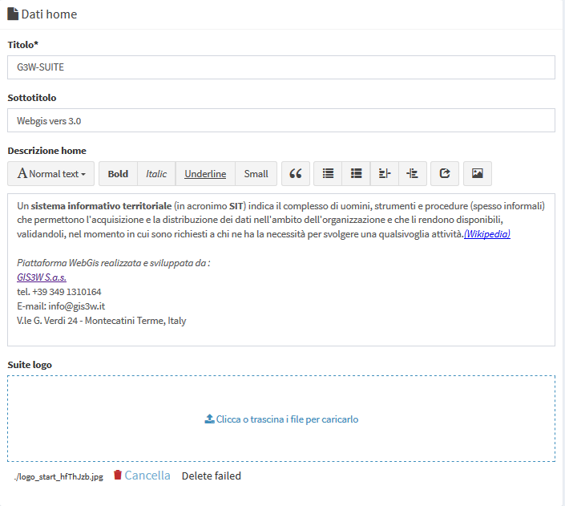
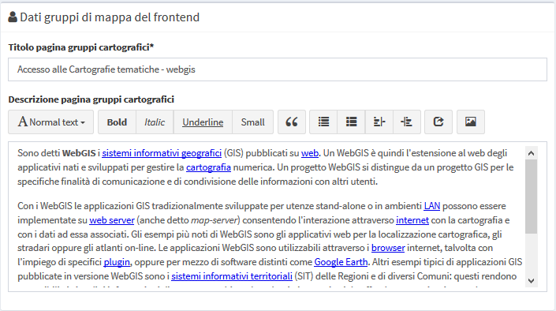
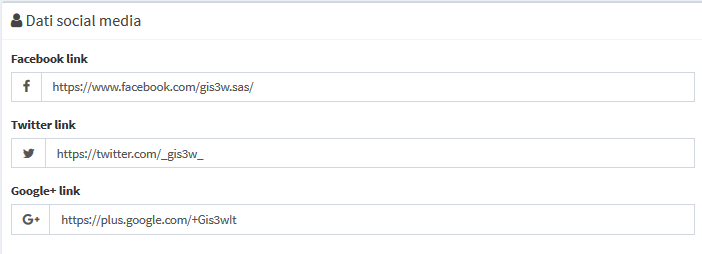
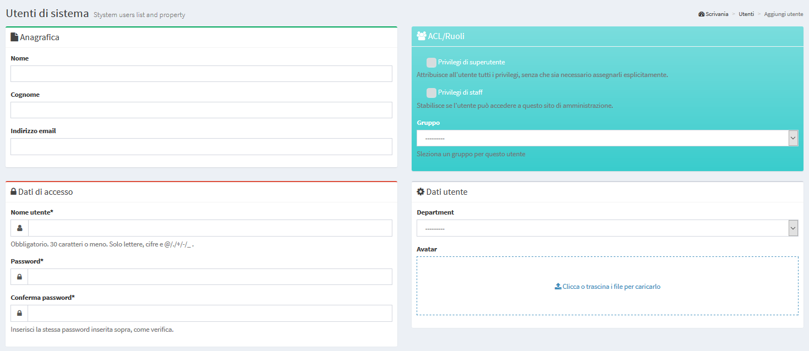
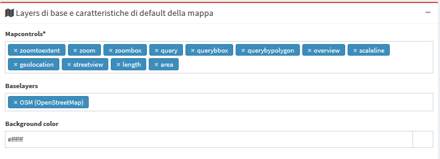
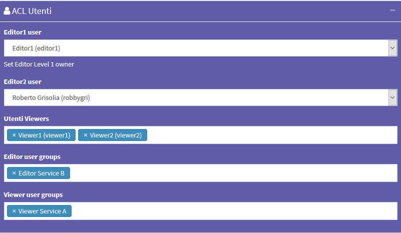
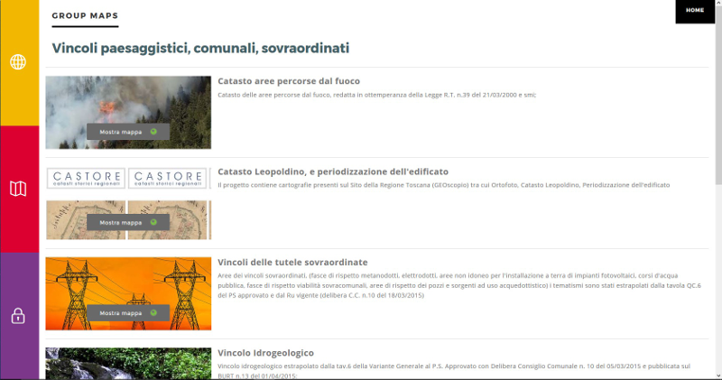

# G3W-ADMIN: the Administration panel
The Administration Panel allows you to manage all aspects related to the publication and configuration of QGIS projects with WebGis services

The main page of the Administration Panel shows:
 * **a bar at the top:**
   * Frontend: for return on the access portal
   * Username: to edit your profile and log out
   * Language: for choosing the language
   * Symbol: to customize the information that can be consulted on the access portal and to access the File Manager tool
 * **a text menu on the left:**
   * Desktop: to go back to the main Administration page
   * Cartographic groups: to create / manage cartographic groups
   * Cartographic MacroGroups: to create / manage the Cartographic MacroGroups
   * Users: to create / manage single users and / or groups of users of the application
   * List of active modules: to create / manage the functional modules active in your installation
 * **a graphic desk in the center of the page**
   * Desk: with access to thematic cartographic groups
   * Module list: to access the respective settings
 

## G3W-SUITE: Access portal customization
From the main page of the **Administration Panel** it is possible to customize the information shown on the Access Portal.

To modify these settings, click on the **Configurations** icon located at the bottom of the bar at the top and then click on the item **"Change general data"** which will appear in the menu below.

In the form that will be accessed from this menu we could define:
 * **Home data:** info that will appear on the portal home page
 * **Data About Us:** info that will appear in the **What is** it session
 * **Frontend map group data** info that will appear in the **Maps** session
 * **Frontend login data:** info that will appear in the **Login/Administration** session
 * **Social media data:** links to the social channels that will appear in the **What is** it session
 * **Map Client data:** title that will be displayed as the main header of the map client
 
### Home data
Information that will be displayed on the access page to the map portal

**ATTENTION:** contents marked with * are mandatory.

### About us data
Information that will be displayed in the **What is** it session

**ATTENTION:** contents marked with * are mandatory.

### Frontend map groups data
Information that will be displayed in the **Maps** session

**ATTENTION:** contents marked with * are mandatory.

### Frontend login data
Information that will be displayed in the **Login/Administration** session

**ATTENTION:** contents marked with * are mandatory.

### Social media data
Links to the social channels that will be displayed in the **What is** it session

**ATTENTION:** contents marked with * are mandatory.

### Map client data
Title that will be displayed as the main header of the map client.

In this last session it is also possible to define a text that will be added to the default one, which can be consulted from the **Credits** button on the map client.

After filling in the various from, click on the Save button to confirm your choices.

## Hierarchical organization of WebGis services and types of Users (roles)
This paragraph allows you to understand how G3W-SUITE makes it possible to manage the individual WebGis services in a structured and hierarchical way.

The organizational levels are:
 * Cartographic MacroGroups
   * Cartographic groups

These organizational levels can be associated with different types of users (Editor 1, Editor2 and Viewer) in order to manage the access / management powers to the individual elements in a granular way

The example shown in the following graph is that relating to the case of a Union of Municipalities where we need to organize the various WebGis services in containers that identify the individual municipal administrations and individual services.

Access policies and individual functional modules may be associated with each WebGis service.

### Types of Users (Roles)
The user management session allows you to create **Users** and **Users Groups** and associate them with specific roles:
 * **Admin1:** user with full powers **including** Django administration (basic suite configuration)
 * **Admin2:** user with full powers **excluding** those of Django administration (basic configuration of the suite)
 * **Editor1:** user administrator of one or more Cartographic MacroGroups for which you will have the possibility of
   * create users and / or user groups
   * create thematic groups and, if necessary, assign them to an Editor 2 user
   * publish WebGis services and define their access policy
   * activate and configure some types of functional modules
 * **Editor2:** administrator of one or more Thematic Groups for which you will have the possibility of
   * publish / update WebGis services and define their access policy
   * activate and configure some types of functional modules
 * **Viewer:** user with access permission in consultation to WebGis services characterized by authentication. The user can also use individual functional Modules if the relative permissions have been attributed to him
 * **Anonymus User:** user to be associated with WebGis services and / or functional modules with free access

### Hierarchical organization of contents
The following paragraph is dedicated to better understanding the relationships between the different types of users and the different elements of the suite (MacroGroups, Map Groups, WebGis services ...).

It is important to remember that while to publish a WebGis service you must first create a Cartographic Group that contains it, the creation/management of Cartographic MacroGroups (and associated Editor 1 users) is optional.

If the use of MacroGroups is not necessary, the use of Editor 1 users is not recommended.**

The following are the two cases below:

#### Absence of MacroGroups
In case of absence of the coupled MacroGruppi/Editor1, the **Admin** user will be the only administrator of the suite and can therefore:
 * create users (individuals and/or groups) of various types
 * create **Cartographic Groups**
 * publish **WebGis services** within the individual **Cartographic Groups**
 * activate some specific modules on individual WebGis services

When creating a cartographic group, the Admin user can define:
 * the eventual user (individual/group) **Editor 2** to associate the Group with
 * **Viewers** users (individuals/groups) who will have access to this container

In the event that the Cartographic Group is associated with a user or a group of users of the **Editor 2** type, they may publish/update WebGis services placed in this container autonomously

Editor 2** users will also be able to define their access policies to the published WebGis services, based only on **Viewers** users associated with the Cartographic Group by the Admin user.

Even the **Admin** user can publish **WebGis services** within a Cartographic Group and, if necessary, associate them with a user (single and/or group) of **Editor 2** type.

#### Presence of MacroGroups
The **Macrogroups** are thematic containers dedicated to the individual superstructures of the Body (e.g. Municipal Administrations of a Union of Municipalities) within which Cartographic Groups dedicated to individual Services (e.g. Registry Office, Public Works, Urban Planning ...) can be created.

Each **Thematic Group** will welcome individual WebGis services.

**Macrogroups** can be created only by **Admin** users.

Each **Macrogroup** can be associated with a first level Editor user (**Editor 1**)

Each MacroGroup can be considered as a watertight compartment within which the associated Editor 1 user (administrator in full of the MacroGroup), will be able to create users and user groups that will be made available to define access permissions for content (Groups Maps, WebGis services, functional modules ...) of the reference MacroGroup only.

In this way it will be possible to create totally independent entities, the MacroGroups, which will be managed exclusively by the user Editor 1 associated with them.

Clearly the Administrator users (Admin 1 and Admin 2) will continue to have full powers over all the created MacroGroups.

As previously specified, **Editor 1** user will be able to:
 * create **users** (individuals and/or groups) of type Editor2 and Viewer
 * create **Cartographic Groups** within its **Macro Group**
 * publish **WebGis services** within their **Cartographic Groups**
 * activate some **specific modules** on individual **WebGis services**

When creating a cartographic group, user Editor 1 can define:
 * the eventual user (individual/group) **Editor 2** to associate the Group with
 * **Viewers** users (individuals/groups) who will have access to this container

In the event that the Cartographic Group is associated with a user or a group of users of the **Editor 2** type, they can publish/update WebGis services placed in this container independently

**Editor 2** users will also be able to define their access policies to the published WebGis services, based only on **Viewers** users associated with the Cartographic Group by the Editor 1 user.

Even the **Admin** user will be able to publish **WebGis services** within a Cartographic Group and, if necessary, associate them with **Editor 1** type users and **Editor 2** (individual and/or group) users.

### Summary table
Below is a summary table of the powers associated with the different types of users.

## Users and Users Groups management
In the left side menu there is the USERS item with four sub-items:
 * **Add user**
 * **User list**
 * **Add user group**
 * **List of user groups**
 
### Add user
Through this form it is possible to insert new users and define their characteristics.

They define themselves:
 * Personal data: name, surname and email address
 * Access data: username and password
 * User backend
 * ACL / Roles
   * superuser privileges (Admin1 and Admin2 users only)
   * staff privileges: deep administration of the application (Admin1 users only)
   * main membership roles (Editor Level 1, Editor Level 2 or Viewer)
   * any user groups Editor of belonging
   * any groups of Viewer users to which they belong
 * User data:
   * Any Departments and image to be associated with the profile

After filling in the various from, click on the Save button to confirm your choices.

### User list
Through this form you can consult the list of enabled users and their characteristics:
 * username
 * role
 * any user groups to which they belong
 * any associated Cartographic MacroGroups (only for Editor1 users)
 * Super user and / or Staff privileges
 * email, name and surname
 * creation date
 * info on user creation (G3W-SUITE or LDAP)
 

Using the icons at the head of each row, you can:
 *  **Modify:** to modify the characteristics of the user
 *  **Delete:** to permanently delete a user
 
### Add User group
Through this form it is possible to insert new user groups and define their role.

It is possible to create only two types of user groups:
 * **Editor:** in which only Editor2 users can be inserted
 * **Viewer:** in which only Viewer users can be inserted

The association between user and user groups is made at the individual user management level.

In the specific form for creating user groups, the following are defined:
 * **Name**
 * **Role** (Editor or Viewer)
 

 
After filling in the from, click on the **Save** button to confirm your choices.

### Users groups list
Through this form it is possible to consult the list of enabled user groups, their characteristics and the individual users belonging to the group.

Using the icons at the head of each row, you can:
 *  **Show details:** see the characteristics of the user group 
 *  **Modify:** to modify the characteristics of the group 
 *  **Delete:** to permanently delete a group and therefore association with users belonging to the group itself 

## Cartographic Macro Groups management
In this section it is possible to view the list of Cartographic Macrogroups, manage them and create new ones.

A Macrogroup was created, for example, to **collect a series of Cartographic Groups belonging to the same macro Service** (single Municipality within a Union of Municipalities) or more simply to have main containers that contain second level groupings (Groups).

In the left side menu there is the **MacroGroup Cartographic** item with two sub-items:
 * **Add MacroGroup:** to create a new Cartographic MacroGroup
 * **MacroGroups list:** to access the list of MacroGroups present
 
### Add MacroGroups
Through this item, available only for the **Admin** user, it will be possible to create a new Cartographic MacroGroup and associate it with an Editor1 type user who will become its administrator.

Let's see in detail the various sub-sessions of the group creation form.

#### ACL users
**Editor users:** you define the first level Editor user who will become the group administrator. This user can manage the MacroGroup by creating thematic Groups, publishing projects and creating Users or Associated User Groups.

#### General data
 * **Title*:** descriptive title of the MacroGroup (will appear in the list of MacroGroups)
 * **Use title and logo as client header:** by default, the map client header, for each WebGis service, is instead made up of:
   * main title (definable at General Data management level)
   * logo and title associated with the Thematic Group
   * title of the WebGis service.
 * **Img logo*:** the logo to be associated with the MacroGroup in the frontend and, possibly, in the client header

After compiling the rom, click on the Save button to confirm your choices.

### MacroGroups list
The menu provides access to the list of cartographic macro-groups present.

There are also a series of buttons to access specific functions:
 *  **Show the details** of the MacroGroup
 *  **Change** characteristics of the MacroGroup
 *  **Cancel** MacroGroup

**ATTENTION:** the removal of the MacroGroup cartographic group will result in:
 * the **removal of all the Cartoghraphic Groups** contained in it
 * the **removal of all the cartographic projects** contained in the individual Groups
 * the **removal of all the widgets** (eg searches) that would remain orphaned after the removal of the cartographic projects contained in the group. See the Widget chapter for more information.

#### Display order of the MacroGroups in the FrontEnd
Through the Drag & Drop function it is possible to define the order of the MacroGroups in the list. This order will be reflected in the FronEnd.

## Thematic Groups Management
In this section it is possible to view the list of Cartographic Groups present, manage them and create new ones.

A Cartographic Group was created to **collect a series of cartographic projects belonging, for example, to the same theme** (Urban Planning Regulations, tourist maps ...) and characterized by the same projection system.

It should be remembered that, when viewing the WebGis services, it will be possible to switch from one cartographic project to another, leaving the geographical extension displayed fixed, only between the projects contained in the same cartographic group.

In the left side menu there is the **Cartographic Groups** item with two sub-items:
 * **Add Group:** to create a new Cartographic Group
 * **Group List:** to access the list of groups present

You can also access the list of groups by clicking on the **"Show"** button in the **Groups** box on the **Desktop**.

### Add Group
Through this item it is possible to create a new thematic group.

By creating a thematic group, some functional characteristics and modules that the WebGis interface will show for all cartographic projects published within the group are also defined.

Let's see in detail the various sub-sessions of the group creation form.

#### General data
 * **Name*:** group identification name (will appear in the group list)
 * **Title*:** descriptive title of the group (will appear in the list of groups)
 * **Description:** free description of the group (will appear when accessing the group)
 * **Language*:** interface language
    
#### Logo image
 * **Header logo img*:** the logo to be displayed at the top left of the WebGis interface
 * **Logo link:** a possible link to associate with the logo
    
#### ACL Users
Access and modification powers are managed.

The options present will vary according to the type of user (Admin or Editor1) who creates / manages the Group
 * **Editor1 User:** defines the user (Editor1) manager of the Group.
 
     The entry is present only when the Admin type user creates the Group
     
     If the Group is created by a user of type Editor1, the Group is associated directly with that user
     
 * **Editor2 User:** defines the user (Editor2) manager of the Group.
 * **Viewers users:** define the individual users (Viewers) who have the credentials to view the contents of the group. By choosing the anonymous user (AnonymusUser) the group will be free to access
 * **Editor user groups:** define the user groups (Editor2) who manage the Group.
 * **Viewer user groups:** you define the user groups (Viewer) which have the credentials to view the contents of the group.

The option **Propagate the permissions of the NEW viewer users and added viewer user groups** allows you to propagate any changes relating to the Viewer users (individuals and / or groups) of the Group to ALL the WebGis services present in it.

This option cancels any differentiation in the access policies applied to the WebGis services contained in the Group.

#### MacroGroup
Possible definition of the belonging MacroGroup.

This option is available only if the Admin user creates the Cartographic Group.

In the event that the Group is created by an Editor1 type user, the Group will be automatically associated with the MacroGroup associated with Editor1 itself.

#### GEO data
Projection system associated with the group.

**N.B.** All projects loaded into the group must be associated with this SRID.

#### Basic Layer Default Map Features
In this box you can define:
 * **Mapcontrols*:** list of tools (buttons) available on the WebGis client:
   * **zoomtoextent:** zoom to the initial extension
   * **zoom:** zoom in and zoom out
   * **zoombox:** zoom tool based on drawing a rectangle
   * **query:** precise query of geographical layers
   * **querybbox:** query via layer box (**N.B. the interrogable layers must be published as WFS services on the QGIS project**)
   * **querybypolygon:** it will be possible to automatically query the features of one or more layers that fall inside a polygonal element of a guide layer. (Eg what's inside a cadastral parcel?). - **N.B. searchable layers must be published as WFS services on the QGIS project**
   * **overview:** presence of a panoramic map
   * **scaleline:** presence of the scale bar
   * **scale:** tool for defining the display scale
   * **mouseposition:** display of mouse position coordinates
   * **geolocation:** geolocation tool (useful for consultation from tablet)
   * **nominatin:** address search tools and toponyms based on OSM
   * **streetview:** Google StreetView on your map
   * **length:** measuring instrument for linear strokes
   * **area:** surface measuring instrument
   * **addlayers:** tool for temporarily uploading .kml and .shp (zipped) vector layers to WebGis
   * **screenshot:** tool to take a screenshot of the map area
 * **Baselayer:** choice of the base maps that will be available on the WebGis client
 * **Background color:** choice of the background color of the maps (default white)

#### Copyrigth
**Terms of use:** description of the terms of use of the map and any other info
**Link to terms:** link to text

After filling in the various from, click on the **Save** button to confirm your choices.
 

### List of cartographic groups
From the menu you can access the list of cartographic groups present.

For each group, the Title and Subtitle defined at the time of creation are shown.

There are also a series of buttons to access specific functions:
 *  **Add a new project** to be published on the WebGis service
 * Number and links to projects published within the Group
 *  **Show group details**
 *  **Change** group characteristics
 *  **Delete** group

**ATTENTION:** the removal of the cartographic group will involve:
 * the **removal of all the WebGis services** contained therein
 * the **removal of all widgets** (eg searches) that would be orphaned after the removal of the WebGis services contained in the group. See the Widget chapter for more information.

Finally, there is a large **+** key to access the form for creating a new group.

#### Display order of cartographic groups in the FrontEnd
Using the Drag & Drop function it is possible to define the order of the Groups in the list.

This order will be reflected within the belonging MacroGroups.

**NB:** currently in the list of Groups it is not present in the subdivision in the belonging MacroGroups but the fact that a Group can be associated with only one MacroGroup still allows you to manage intuitively what will be the display order.

## Publication/Management of new WebGis services
### Publish a new QGIS cartographic project
It is possible to publish new QGIS projects:
 * **from the list of cartographic groups:** click on the button located under the box of the cartographic group in which you want to publish the project.
 * **from the list of cartographic projects published within a group:** by clicking on the item

In the form to which you will have access we could define the aspects of the project being published:
#### QGIS project
**QGIS file*:** load the QGIS cartographic project to be published (.qgs file)

#### ACL Users
Access and modification powers are managed.

The options present will vary according to the type of user (Admin, Editor1 or Editor2) who creates / manages the WebGis service.
 * **User Editor1:** defines the user (Editor1) manager of the WebGis service.

The entry is present only when the Admin type user creates the WebGis service

In the event that the WebGis service is published by a user of type Editor1, the WebGis service is associated directly with that user
 * **User Editor2:** defines the user (Editor2) manager of the WebGis service.
 
   The item is present only when the user of the Admin or Editor1 type creates the service
 WebGis. 
   In the event that the WebGis service is published by a user of type Editor2, the WebGis service is associated directly with that user

 * **Viewers users:** define the individual users (Viewers) who have the credentials to view the WebGis service. By choosing the anonymous user (**AnonymusUser**) the group will be free to access
 * **Editor user groups:** define the user groups (Editor2) who manage the service.
 * **Viewer user groups:** you define the user groups (Viewer) which have the credentials to view the content of the service.

#### Default base layer
In this session you define which base layer should be active at startup.

The choice is limited to the list of base layers activated for the cartographic group in which you work.

It is also possible not to define any active base layer at startup.

#### Description
 * **Description:** Free description of the project that will appear at the public portal level.
 * **Thumbnail (Logo):** logo to associate with the project. This image will be viewable:
   * in the list of projects within the cartographic group
   * in the window that appears in the WebGis interface that allows you to switch from one cartographic project to another among those belonging to the same thematic group

#### Options and actions
These options allow you to define the type of WMS / WFS query to be carried out and the maximum number of results obtainable following a query.
 * **Maximum number of results per query*:**
 * **Check type for point query*:**
 * **Query control type for BBOX*:**
 * **Control type for query by polygon*:**

**ATTENTION:** contents marked with * are mandatory.

After filling in the various from, click on the Save button to confirm your choices.

If the operation is successful we will see the new project appear in the list of projects included in the thematic group in which it was working.

#### Display order of the WebGis Services in the FrontEnd
The individual WebGis services will be arranged, within the Thematic Groups to which they belong, in alphabetical order based on the title of the service.

## Manage/Update WebGis services
WebGis services are managed within the individual cartographic groups they belong to.

Access to the cartographic group will allow you to view the characteristics and parameters associated with the group.

To access the list of WebGis services, click on the link associated with the number of projects within the group of interest.

In this section it is therefore possible to view the list of cartographic projects present, view them, manage them and create new ones.

Through the single icons, placed at the level of each project, it is possible to:
 *  **Display the cartographic project on the WebGis interface:** to check the display by the user
 *  **Access the list of layers** present within the project and define their functional aspects
 *  **View the project specifications**
 *  **Update a map project:** update of the QGIS file and other options related to the project
 *  **Remove a cartographic project**
   **Warning:** removing a project also removes all the widgets (e.g. searches) that would be orphaned after the project has been removed
 *  **Download of the QGIS project** (.qgs)
 *  **Test the WMS Capabilities** of the layer

### Setting up the overview map for WebGis services
In this session it is also possible to define which of the cartographic projects loaded within the group will be used as a panoramic map.

To set the panoramic map, simply tick the check box for the selected project in the **"Overview"** column.

## G3W-SUITE: widget management
Once a cartographic project has been published, it is possible to access the list of the geographical states that compose it and define some functional aspects that will be enabled at the client level.

Next to each layer are a series of icons and checkboxes:
 *  **Layer cache:** allows you to activate and manage the cache of the single layer at the project level
 *  **Editing layer:** shows if the online editing function is active on the layer and allows you to activate and define it
 *  **List of widgets:** shows how many widgets (eg searches) are associated with this layer and allows you to activate new ones
 * **No legend:** it allows to define if the layer must have published the legend at TOC level of the WebGis client
 * **Download:** allows the download of the layer, in .shp format, at the TOC level of the WebGis client
 * **WMS external:** to speed up loading, the WMS layers present in a QGIS project are managed directly by Django and not by QGIS-Server. However, this method prevents the application of any dressing (e.g. transparencies) defined at the project level. The choice of the external WMS option means that the WMS layer is managed directly by QGIS-Server and therefore the associated clothing is applied.
 *  **Type:** illustrates the type of data (WMS, PostGis, SpatiaLite, GDAL / OGR ...)
 * **WFS:** a check mark shows whether the layer is published as a WFS service or not
 * **Name:** name of the layer
 * **Label:** layer alias applied at the QGIS project level

## Search widget setting
In G3W-SUITE it is possible to create search widgets that will be saved by referring to the layer identifiers (for example the DB parameters: IP, DB name, schema, layer name).

This aspect allows, once a search widget for a layer has been created, to have it available on all the projects in which the layer is present, without having to rebuild the widget from scratch each time.

In the list of layers present within the project, **identify the layer on which to create and associate the search widget** and click on the icon 

By clicking on the icon, the list of already active (or activatable) widgets associated with the layer will be shown.

These widgets can be **modified, deleted or disconnected** using the appropriate icons.

**ATTENTION: deleting a search** will delete it from all projects in which that search is active.

To **deactivate a search** from a project, simply disconnect it using the check-box on the right.

To **create a new search**, click on the link **New widget**.

In the pop-up that appears, the **"Search" type** will be chosen.

The search widget is structured by defining some aspects in the related form:
 * **Title of the form**
   * **Type:** "Search"
   * **Name:** name that G3W-SUITE will use to internally register the search widget.
 * **General configuration of research and results**
   * **Search title:** title that identifies the search that will become available in the **'Research'** panel of the WebGis interface
 * **Search field settings**
   * **Field:** field on which to carry out the research
   * **Widget:** method of entering the value to be searched
             InputBox: manual compilation
             SelectBox: values ​​shown via drop-down menu (only for PostGis or SpatiaLite layers)
   * **Alias:** alias assigned to the field that will appear in the search form
   * **Description:** description assigned to the field
   * **Comparison operator:** comparison operator (**=, <,>,> <,> =, <=, LIKE, ILIKE**) through which the search query will be carried out. The LIKE and ILIKE operators will only be available for PostGis or SpatiaLite layers
   * **Dependency:** this parameter (optional) allows, only in the case of SelectBox widgets, to list the list of values ​​of a field filtered according to the value defined for the previous fields. The tool allows, for example, to display, in the drop-down menu dedicated to the choice of cadastral particles, only the particles connected to the sheet chosen in the previous option. This function is only available for PostGis or SpatiaLite layers.

The button 
 allows you to add additional fields for the construction of the search query currently manageable through the AND operator alone.

The example below shows the compilation of the form for creating a search widget dedicated to a cadastral cartography layer.

Once the form has been filled in, click on the OK button to save the settings.

Once the settings are saved, the created widget will appear in the list of Widgets associated with the layer.

The widget will already be "connected" and therefore available in the WebGis interface.

**IMPORTANT:** the created search widget will now be available (disconnected) for all projects in which the layer with which it has been associated will be present.

**This will allow you not to have to recreate the widget several times and to decide in which projects to activate the search and in which not.**

