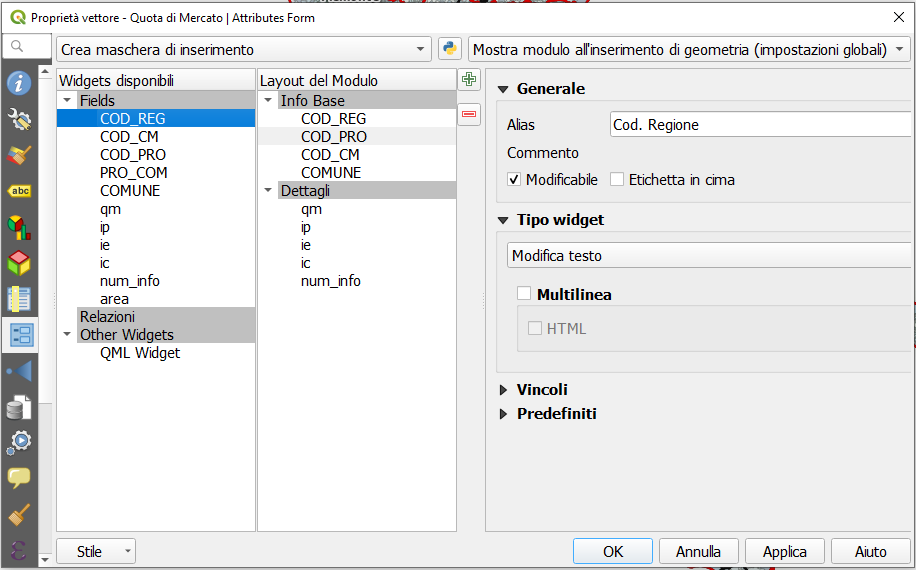
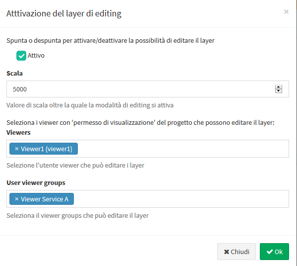
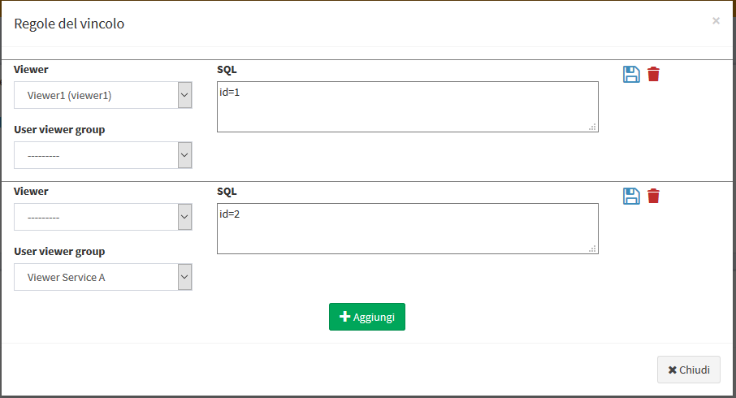
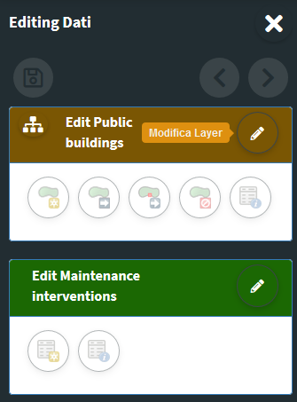
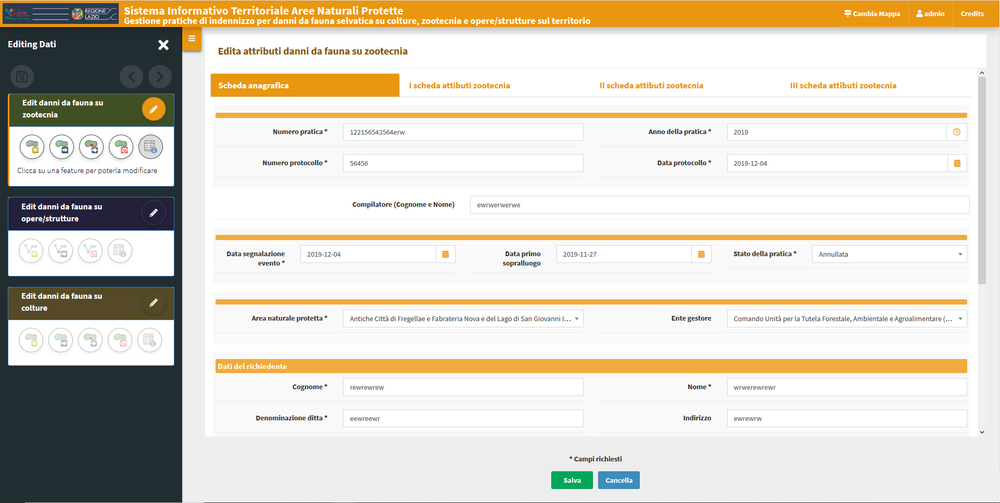

# Online editing
## Activation and configuration of the online editing function

The G3W-SUITE platform allows you to manage and create editing on **PostGreSQL/PostGis layers** present within published projects.

**The tool also allows you to manage relational type editing (1:n).**

The editing settings are defined partly at the QGIS project level (editing form structure, widgets associated with individual attributes, 1: n relationships) and partly at the Administration level (users with editing power, activation scale, any geoconstraints).

It should be noted that this function manages **multi-user editing** through a **features-lock system**.

When an enabled user activates the editing function at the map client level, the features visible on the map at that time will be blocked, in relation to the editing aspect, for all the other enabled users who will still be able to edit features present outside this geographical extension. .

This block will be deactivated when the user exits the editing mode.

### QGIS project level settings
#### Definition of the attribute editing form
At the QGIS project level, for each layer it is possible to define the structure of the attribute form associated with the display of results following query operations.

The same structure will be used in web editing mode for the insertion/modification of the attributes associated with the features.

The definition of the form structure can be managed, on QGIS, from the **Properties of the vector**, in the **Attribute Form** section.

#### Definition of editing widgets associated with individual attributes
At the QGIS project level (always from **Vector Properties**, **Attribute Form** section) it is possible to define an alias and an editing widget for each attribute.

The alias and editing widgets defined at the project level will be available during web editing with some limitations.

Below are the available widgets and any limitations:
 * Checkbox
 * Date/time: management of the date only
 * Attached*
 * Interval
 * Edit text with excluded options:
   * multiline
   * html
 * Unique values
 * Map values
 * Value relationship with excluded options:
   * sort by value
   * allow multiple selections
   * filter expression
   
With regard to the **Attachment widget**, it is necessary to specify that the association of a multimedia file with a feature requires that this file is uploaded to a dedicated space (exposed on the web) on the server and that the association takes place via a URL that refers to that file. .

This solution allows you to consult the associated attachments also by loading the layer in question directly from QGIS or from other GIS software.

**Additional settings at single layer level**

In the Attribute Form section of the Layer Properties it is also possible to define whether:
 * the attribute can be modified or not during the editing phase
 * any default values

The compulsory filling of the field and/or its uniqueness will instead be defined based exclusively on the characteristics of the field associated at the PostGreSQL / PostGis table level.

#### Editing related tables in 1: n mode
In the event that, at the QGIS project level, one or more 1: n type relationships have been associated with a layer (Project menu → Properties…, Relations section), it will be possible to carry out relational editing also on the webgis platform.

Also for the tables related in 1: n mode it will be possible to define the attribute form structure, aliases and editing widgets at the QGIS project level and automatically find these configurations and tools on the webgis platform.

### Settings at the Administration panel level
To activate the online editing functions on a PostGreSQL / PostGis layer present in the QGIS project published with the WebGis service, access the Layer list section of the project itself within the administration panel of G3W-ADMIN.

The layer list identifies the PostGreSQL / PostGis layer on which you want to activate the editing function and click on the Editing layer icon located on the left 

Clicking on the icon will open a modal window that will allow you to:
 * define the scale at which it will be possible to activate the webgis editing function (only for geometric tables)
 * define Viewer users (individuals or groups) enabled for online editing

With regard to the last aspect, it should be noted that:
 * Viewers users (individuals or groups) available in the drop-down menu will be limited to those who have allowed access in consultation to the WebGis project in which the layer is contained
 * Users of Editor I and Editor II type "owners" of the project are enabled by default to the online editing function

#### 1: n relational editing
To allow editing on the related table in mode 1: n with a layer, the editing function must also be activated (always in the same way) also with the related table present in the list of project layers

#### Geo-constraints
The online editing function also allows you to manage geo-constraints or define spatial constraints that allow the user to insert/modify features only if they intersect or are contained within specific features of a second polygonal layer.
icon_constraints_setting.png New constraint to create a new geo-constraints.

The icons placed next to any alleys already present allow you to edit/delete the constraint itself.icon_constraints_setting.png

Clicking on the item + New constraint will open a modal window which will allow you to define the polygonal layer (among those present in the project) on which the constraint itself must be based.

Once the layer has been defined, the constraint will appear in the list and can be parameterized using the Rules icon 

Clicking on this icon will open a modal window which, by pressing the button , it will allow you to define, for each user and / or group of users, the feature (s) of the layer defined as geo-constraints, within which editing will be allowed.

The definition of the feature (s) will be done through a freely compiled SQL expression, which must refer to the attributes and values of the layer defined as geo-constraints.

Following the definition of the individual SQL, the Save icon  will allow you to validate the SQL itself, in order to ensure proper functioning of the constraints itself.

Once all the constraints have been entered and validated, click on the Close button to confirm the rules.

## Online editing tools at map client level
Once the online editing function has been activated and configured on one or more layers of a WebGis project, by accessing this service in consultation (as an accredited user for editing) the map client will show the Tools menu on the left column in which it will be displayed. in addition to any other items, the one relating to editing is available.

 

By clicking on the Data Editing item, the side menu will show the editing tools for all the layers on which this function is activated.

The actual activation of the editing function for the individual layers will take place by clicking on the Edit layer icon.

The tools available depend on the type of layer (geometric or alphanumeric):

**Geometric layers**
 *  **Add features:** to add a feature to the geometric table
 *  **Move features**
 *  **Update vertices features:** to modify the shape of a geometry
 *  **Remove features**
 *  **Modify features:** to modify the attributes associated with an existing feature

Activating the **Add features** and **Update vertices features** tools relative to a geometric layer also allows you to activate the snap intralayer function.

**Alphanumeric layer**
 *  **Add features:** to add a record to the alphanumeric table
 *  **Modify features:** to modify the attributes of an existing record

Whenever a new feature / record is added or an existing feature/record is modified on the client, the attribute editing form and the respective editing widgets will be displayed as defined at the QGIS project level.

Any mandatory fields will be marked with an asterisk.

Any unfulfilled constraints will be highlighted with specific warning messages shown in red.

The changes made can be saved only after satisfying any constraints of mandatory and / or uniqueness.

For this reason the button  will be disabled until all constraints are met.

#### Saving changes
Saving all the changes made in an editing session can be done in two ways:
 * by clicking on the diskette icon  placed at the top right. The changes made will be saved and you can continue making new changes
 * by deactivating the editing by clicking on the Edit layer icon . 

By deactivating the editing function, a modal window will be displayed which will show the list of changes made and the request for confirmation or not of saving them.

Remember that during the editing phase the undo/redo icons  allow you to delete/restore the latest changes made.

### Editing related tables
G3W-SUITE allows for relational editing; for this to be possible it is necessary that:
 * on the published QGIS project there are one or more geographic layers related (1: n) with one or more alphanumeric tables
 * on the administration panel the editing function has been activated both on the parent layer and on the child layers
 * the operator user is enabled for the editing function on these layers

The activation, at the cartographic client level, of the editing mode on the parent layer automatically determines the possibility of also managing the information on the related table.

The insertion of a new geometry or the modification of an existing one determines the display of the attribute form divided into two or more macro tabs, one for the parent layer and the other for the child layers

Moving on the macro tab relating to one of the child layers, the list of records already associated with the edited feature will be displayed

In this macro tab it will be possible to:
 * create and add a new records related to the edited feature
 * associate an existing records (linked to other features or orphan) to the edited feature
 * modify the records currently associated with the edited feature

#### Creation of new related records
By clicking on the icon  (located at the top right) the attribute form relating to the child layer in question will open (possibly structured as per QGIS project), you can fill in the individual attributes and save the new record. The change must be validated by clicking on the Save button at the bottom of the form.

#### Association of an existing record
By clicking on the icon  (located at the top right) you can associate a record, already linked to other features or orphaned, to the edited feature.

In the new window displayed:
 * the list of all orphaned or associated records will be displayed;
 * a generic filter will allow you to locate the record of interest;
 * by clicking on the individual records these will be associated with the edited features and, possibly, dissociated from other features

#### Modification of an already associated record
A series of icons appear to the right of each record associated with the edited feature:
 *  Erase relationship: to dissociate the record from the edited feature, the record will not be deleted but will become an orphan
 *  Delete feature: permanently delete the record
 * Modify feature: modify the values associated with the attributes of this record; the change must be validated by clicking on the Save button at the bottom of the form.
 * the attribute form relating to the child layer in question (possibly structured as per QGIS project), you can fill in the individual attributes and save the new record.

#### Saving changes
Saving changes made at the level of related tables is managed by saving made at the level of the parent layer:
 * by clicking on the diskette icon  placed at the top right. The changes made will be saved and you can continue making new changes
 * by deactivating the editing by clicking on the Edit layer icon . 
 
By deactivating the editing function, a modal window will be displayed which will show the list of changes made and the request for confirmation or not of saving them.

 
