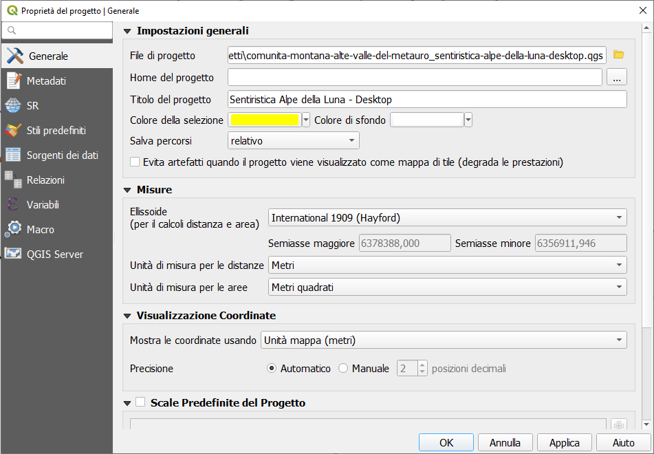
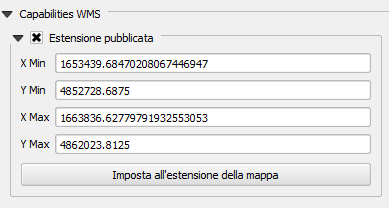
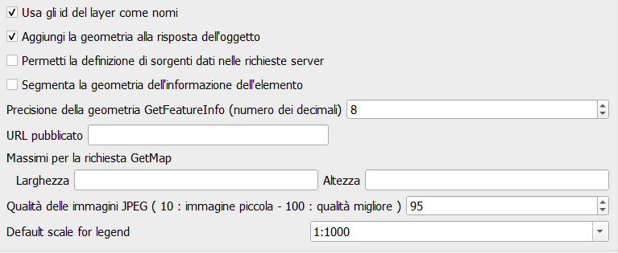
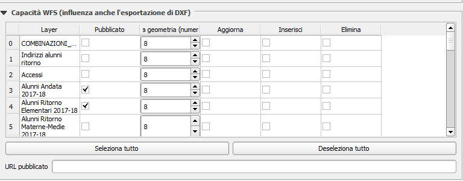
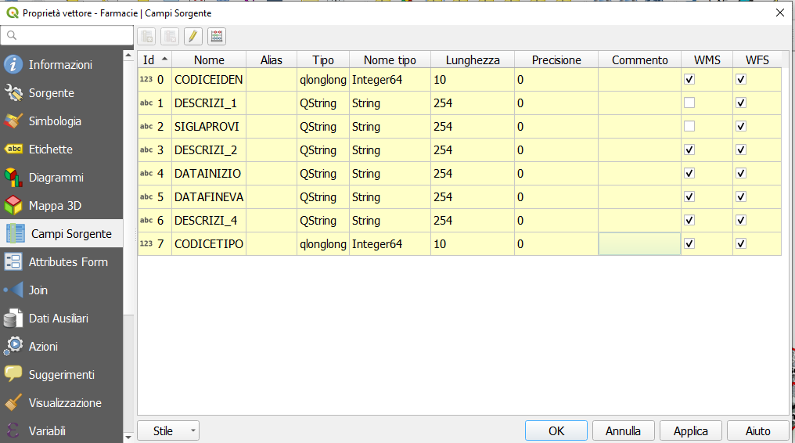

# QGIS: cartographic project settings
In the QGIS cartographic projects you can set some parameters and options that affect functionalities and contents in the derivative WebGis service.
In particular, some parameters of the project affect:
* the webgis service identification name
* the associated basic metadata
* the capabilities of the service
* the geographical extension displayed when the WebGis service starts
* the projection systems for which the project is available
* the possibility to exclude some associated print layouts on the WebGis service
* which layers are questionable and searchable
* which vector layers can be queried using WFS
* which fields (for each vector data) and with which aliases are made visible following interrogation on the WebGis service 
* the structure of the query form visible on the WebGis service
      
The following paragraphs describe the settings relating to the QGIS cartographic project which will have the greatest implications in relation to the published WebGis service.

## QGIS: ownership of the project
From the **Project → Properties** menu, you can access the **Project Properties** window and the three submenus of our intererest:
 * General
 * Data sources
 * QGIS server
 
### General
#### General Settings
**In this section you can define the title of the project.**
This title will be used at the G3W-SUITE application level to uniquely identify the published project; for this reason **it will not be possible to assign the same name to different projects published on the WebGis service**.
**We strongly advise against using special characters, or numbers in the project name.**

#### Data sources
**This submenu defines the layers that can be queried at the WebGis service level.**

The only column to consider is the one called **Interrogable**.

#### QGIS Server
This window is divided into sections:

##### Service capabilities
In this section it is possible to define the capabilities of the service.

This information, together with info about the structure of the attribute tables of the layers present in the project, will be displayed in the **Metadata session** of the cartoghrapic client.

##### Capabilities WMS - Advertised extent
In this section it is possible to define the geographical extension displayed when the WebGis service starts.
    
The define it, set the desired geographical view on the map and then click on the **'Use Current Canvas Extent'** button.

##### WMS Capabilities - CSR restrictions
In this section it is possible to define the projection systems for which the project is available in relation to OGC services.

It is clearly necessary to insert the projection system on which the project was made, the SR in question is added by clicking on the **'Used'** button.

Other geographic reference systems can be implemented by clicking on the **'+'** button and choosing from the list of reference systems.

##### Capabilities WMS - Exclude layouts
In this section it is possible to exclude some of the print layouts that are associated with the cartographic project from the availability of the WebGis service.

##### Capabilities WMS - General aspects
Two further aspects are manageable with regard to WMS capabilities
 * in general it is recommended to **use the layer ids as names**
 * the option **"Add geometry to feature response"** must be checked to activate the **zomm to te features** on the WebGis service

##### WFS Capabilities
In this section it is possible to define which layers are exposed as WFS services.
The WFS service if you want activate folloing types of query:
 * bbox
 * bypolygon
 
It is sufficient to check only the "Published" column
 
 

### QGIS: layer properties
#### Simbology
The rendering style associated with the individual layers is replicated autonomously on the WebGis service.

If external SVG icons are used (added to the basic ones of QGIS, via the **Settings -> Options -> System -> SVG paths**), these must be uploaded to the server (through the File Manager tool) in order to be used by QGIS Server.

##### Manage custom SVG icons
In the installation procedure of the G3W-SUITE application, an "svg" named directory is created on the server.

Within this directory it is therefore possible to store SVG icons, also organized in subdirecory.

The **Configurations icon** , located in the upper right corner of the Administration Panel, allows you to access a menu that includes the **File Manager** item.

Through this tool it is possible to manage SVG icons on the server in a simple and intuitive way.

**PS:** remember that the **File Manager** tool also allows you to manage the synchronization of geographical data (in the case of using physical files) and the management of multimedia files. See dedicated paragraphs.

#### Definition of the fields that can be consulted for each layer
Within the QGIS project it is also possible to define, for each layer, which fields are available following query on the WebGis service.

To define these settings, you access the properties of one of the vectors previously defined as searchable and choose the **'Source Fields'** submenu in the **'Layer Properties'** window.

This submenu lists the fields associated to the table of the vector.

The check in the check box of the **'WMS'** column defines whether or not the values contained in this field will be available following the query on the WebGis service.

 
 
#### Viewing multimedia content
Multimedia contents (images, pdf, web URL ...) can be viewed interactively on the map client following publication of the QGIS project.

In the case of web links, simply insert them (preceded by the prefix http:// or https://) within the dedicated attribute fields

In the case of multimedia files it is necessary:
 * upload the media file to the **media_user** folder (folder exposed on the web) accessible through the **File Manager** tool in the Suite Administration Panel
 * insert the web link to this file in the dedicated attribute field

The link to the file can be obtained in the following way:
 * application domain + media_user + path of any subfolders + file name

Example:
 * application domain: **https://dev.g3wsuite.it**
 * file **file_A.pdf** located in the folder **/media_user/form/**
 * web link: **https://dev.g3wsuite.it/media_user/form/file_A.pdf**

Following queries at the client-map level, we will have different behaviors based on the type of content:
 * **image**: preview display in the form, click on the preview to superimpose the image in real size
 * **web link or other multimedia file**: display of an **Open** orange button to allow consultation of the content

#### Definition of the attribute display form
For each layer it is possible to define the structure of the attribute form associated with displaying the results following query operations.

On QGIS it is in fact possible to build a personalized form (query form) by creating thematic tabs and groups and defining the distribution of the individual fields and their aliases.

This structural organization will be replicated directly on the query form on the WebGis service.

 
 
