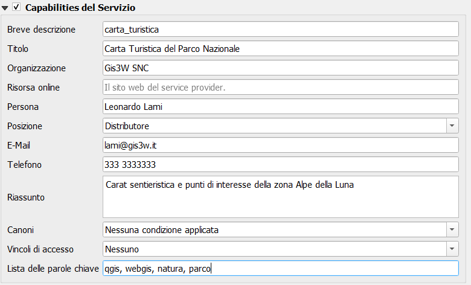
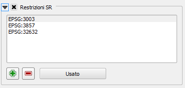
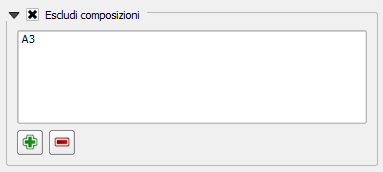
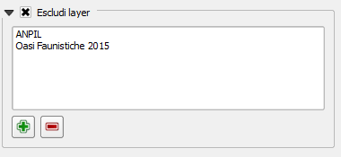

# QGIS: cartographic project settings
The cartographic projects created on the QGIS software and dedicated to publication on the WebGis service present some parameters and options that affect the functionality and contents of the WebGis service itself.
In particular, some parameters of the project affect:
* the project identification name once loaded on the G3W-SUITE application
* the associated basic metadata
* the capabilities of the service
* the geographical extension displayed when the WebGis service is started
* the projection systems for which the project is available
* possible exclusion of print layouts on the WebGis service
* possible exclusion of layers on the WebGis service
* which layers are questionable
* which raster layers can be queried in WCS format
* which fields and with which aliases are made visible, following interrogation, for each vector data
* the structure of the query form visible on the WebGis service
      
The following paragraphs describe the settings relating to the QGIS cartographic project which will have the greatest implications in relation to the published WebGis service.

## QGIS: ownership of the project
From the **Project** → **Project Properties** ... menu, access the Project Properties window and from here you can access three submenus whose parameters influence the publication of the WebGis service:
 * General
 * Carrier information
 * OWS server
 
### General
The subsection of interest is exclusively to the first.

#### General Settings
**In this section you define the name of the project.**
This name will be used at the G3W-SUITE application level to uniquely identify the published project; f**or this reason it will not be possible to assign the same name to different projects published on the WebGis service**.
**We strongly advise against using special characters or numbers in the project name.**

#### Data sources
**This submenu defines the layers that can be queried at the WebGis service level.**

The only column to consider is the one called **Interrogable**.

#### QGIS Server
This window is divided into sections that we will analyze below:

##### Capabilities of the service
In this section it is possible to define the capabilities of the product service.

This information, together with that associated with the data structure of the individual project layers, will be displayed associated with the WebGis service in the Metadata session.

##### Capabilities WMS - Extension published
In this section it is possible to define the geographical extension displayed when the WebGis service is started.
    
The easiest procedure to follow is to set the desired geographical view on the map and then click on the **'Set to map extension'** button.

##### WMS Capabilities - SR Restrictions
In this section it is possible to define the projection systems for which the project is available in relation to OGC services.

It is clearly necessary to insert the projection system on which the project was made, the SR in question is added by clicking on the **'Used'** button.

Other geographic reference systems can be implemented by clicking on the **'+'** button and choosing from the list of reference systems.

##### Capabilities WMS - Exclude compositions
In this section it is possible to exclude some of the print layouts that are associated with the cartographic project from the availability of the WebGis service.

By clicking on the **'+'** button you have access to the list of print layouts associated with the projects and select those to be excluded from the availability of the WebGis service.

##### Capabilities WMS - Exclude layers
In this section it is possible to define the list of layers contained in the project that will not be exposed in the WebGis service.

##### Capabilities WMS - General aspects
Two further aspects are manageable with regard to WMS capabilities
 * in general it is recommended to use the ids of the project layers as identifiers
 * to be able to make the zoom function on the results of a search or those of a query active on WebGis, the option "Add geometry to object response" must be activated

